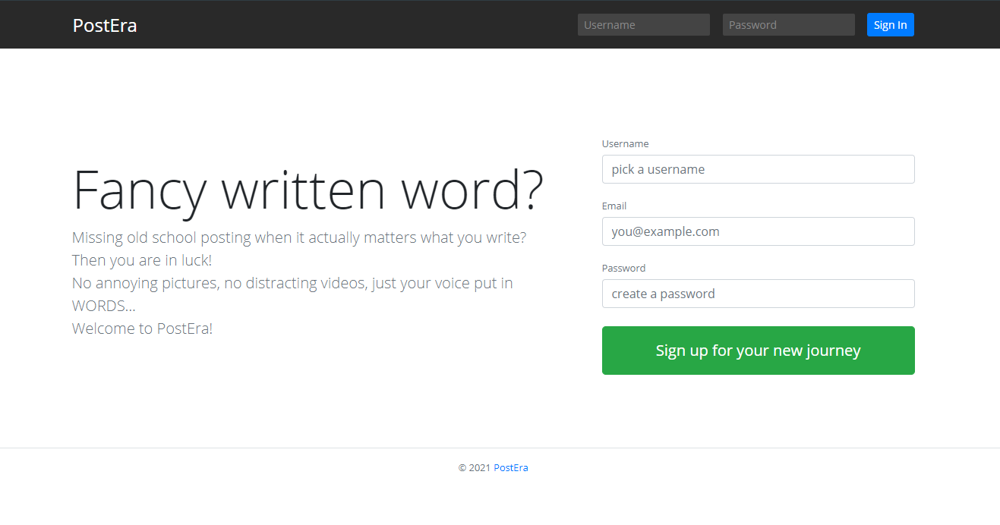

# PostEra Social Media Platform

> Social media application built with JavaScript ES6+, Node.js, Express.js, MongoDB, EJS, Socket.io, and BootStrap.



## Features

- User registration with front-end and back-end validation.
- Users can make posts, follow other users, see fresh posts in linefeed.
- Live search in posts.
- Live chat for active users.
- CSRF attack protection, sanitization of user-generated HTML.
- API to create, delete and get all posts belonging to a user.

## Usage

### Environment variables

Create a .env file in the root and add the following:

```
PORT = 3000
CONNECTIONSTRING = <your mongodb uri here>
JWT_SECRET = "123abc"
```

### Run

Run backend and frontend ( :3000)

```js
npm run dev
```

## Build and deploy

Run project to generate a fresh bundle of front-end code.
Webpack is pre-configured to put a bundle in the **public** folder in the **root** (see webpack.config.js).
